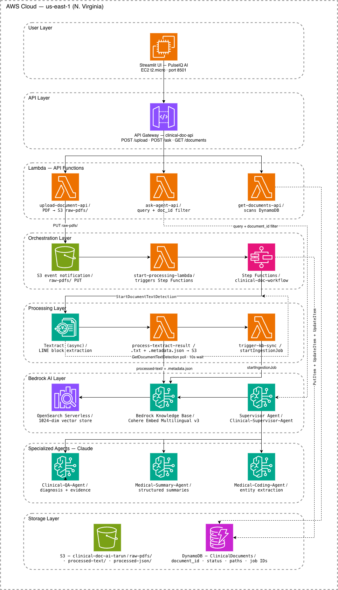

# PulseIQ AI

PulseIQ AI is an AI-powered clinical document intelligence platform built on AWS that transforms patient medical records and diagnostic PDFs into searchable, context-aware clinical insights using semantic retrieval, generative AI, and multi-agent reasoning.

---

## Live Demo

[Open PulseIQ AI](http://34.224.67.193:8501/)

---

## Features

* Upload and process clinical PDF documents in real time
* Automated OCR extraction using Amazon Textract (asynchronous workflow)
* Event-driven document processing pipeline using AWS Step Functions
* Bedrock Knowledge Base integration with automated ingestion sync
* Semantic retrieval powered by OpenSearch Serverless vector storage
* Multi-agent AI architecture using Amazon Bedrock Agents
* Supervisor agent orchestration for collaborative clinical reasoning
* Real-time conversational querying through a Streamlit-based interface
* DynamoDB-backed document metadata tracking and indexing

---

## AWS Services Used

* Amazon S3
* AWS Lambda
* AWS Step Functions
* Amazon Textract
* Amazon Bedrock
* Amazon Bedrock Agents
* Bedrock Knowledge Bases
* OpenSearch Serverless
* Amazon DynamoDB
* Amazon API Gateway
* Amazon EC2
* Amazon CloudWatch

---

## Architecture Diagram

---

## System Workflow

1. User uploads a clinical PDF through the Streamlit interface
2. API Gateway routes the request to the upload Lambda
3. PDF is stored in Amazon S3 (`raw-pdfs/`)
4. S3 event notification triggers the Step Functions workflow
5. Amazon Textract asynchronously extracts document text
6. Process Lambda converts extracted content into clean text + metadata
7. Bedrock Knowledge Base ingestion syncs embeddings into OpenSearch Serverless
8. Supervisor Agent routes queries to specialized clinical agents
9. AI-generated responses are returned through the Streamlit UI

---

## AI Components

### Supervisor Agent

* Clinical-Supervisor-Agent

### Specialized Agents

* Clinical-QA-Agent
* Medical-Summary-Agent
* Medical-Coding-Agent

### Embedding & Retrieval

* Cohere Embed Multilingual v3
* OpenSearch Serverless vector index
* Amazon Bedrock Knowledge Base

---

## Tech Stack

Python • Streamlit • AWS • Amazon Bedrock • DynamoDB • OpenSearch Serverless • Textract • Step Functions

---
